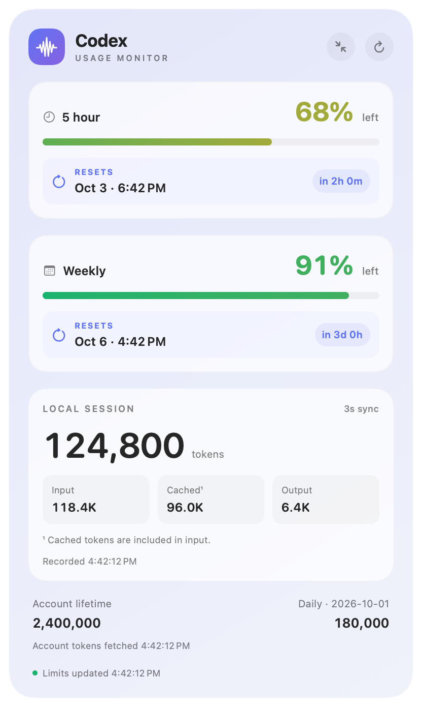

# Token Usage for Mac

A native SwiftUI desktop panel and menu-bar app. Drag the panel to position it. The menu bar controls visibility, small/medium size, keeping above windows, refresh, reconnect, and quit. Follows macOS light/dark appearance.

*Example screenshot uses fictional data. No personal account information is included.*

## Use the built app

After building from source, the ready-to-run app is `build/Token Usage.app`. Double-click it in Finder. You do not need Xcode, Homebrew, an API key, or additional packages to run the built app. Keep Codex installed and signed in so the monitor can read account usage.

For a permanent location, quit Token Usage from its menu-bar menu, copy the app into Applications in Finder, and open that copy. The widget runs while Token Usage is open; it does not launch automatically at login. You can add it to macOS Login Items if desired.

Drag the panel to move it. Use the header's size button to switch between small and medium, and the refresh button to fetch account usage immediately. The chart icon in the menu bar offers hide/show, keep above windows, reconnect, and quit.

Remaining usage bars transition continuously from green through yellow to red as allowance is consumed. Reset badges show the date, local time, and countdown. A 97% remaining weekly allowance means 3% used; this is not a conversion to a fixed token quota.

## Build from source

Build with `zsh scripts/build.sh`, then open `build/Token Usage.app`. Requires macOS 14+ and an installed, signed-in Codex. No API key is needed. The app uses the installed Codex app-server and existing Codex sign-in without reading or copying credentials.

Building requires Apple's Swift compiler and macOS SDK (provided by Command Line Tools or Xcode). The output is locally ad-hoc signed for this Mac, not a notarized release for distribution. Generated app binaries and compiler caches are ignored by Git; rebuilding creates the app from the checked-in source.

Account limit windows and token summaries refresh every 30 seconds, with limit notifications applied as received. Remaining percentages are clamped to 0–100; unknown values are unavailable. A timestamp and warning color indicate stale limits. Account token metrics have their own fetched timestamp; daily buckets show the service's date, never an inferred current-day value.

Latest local session tokens are cumulative tokens from the most recently recorded local session, checked every 3 seconds. They are not an account-wide total, a quota conversion, or a count of all simultaneously running sessions. Cached input is part of input, and reasoning is part of output. Counts only change when Codex writes a token event. Local sessions active in the last seven days are scanned; partial records are ignored until complete. No session messages are persisted by this app.

The account service can delay token summaries. Frequent polling cannot make upstream totals instantaneous. Desktop panel updates run while this app is running; it is not a WidgetKit extension in macOS's widget gallery. This panel supports frequent updates without WidgetKit scheduling.

`UsageProvider` is the connection boundary for future Claude/Gemini providers; those connections are not implemented.

Verification: run the built executable with `--self-test` for parser checks and `--probe` for a read-only live connection check.

Regenerate the example screenshot with `"build/Token Usage.app/Contents/MacOS/TokenUsage" --render-example`. This renders the actual widget UI with fictional values and does not connect to Codex or read local sessions.

Protocol: https://learn.chatgpt.com/docs/app-server
